.. _ref-examples:

Examples
********

BurnMan comes with a large collection of example programs under examples/.
Below you can find a summary of the different examples.
They are grouped into three categories: :ref:`ref-example-class`,
:ref:`ref-example-simple` and :ref:`ref-example-advanced`.
We suggest starting with :ref:`ref-example-class`, which introduces the main
class types in BurnMan. The :ref:`ref-example-tutorial` then provides a useful
introduction to the seismic tools for new users of BurnMan.

Finally, we also include the scripts that were used for all computations and
figures in the 2014 BurnMan paper in the misc/ folder, see
:ref:`ref-example-paper`.

.. _ref-example-class:

Class examples
==============

The following is a list of examples that introduce the main classes
of BurnMan objects:

  - :mod:`~examples.example_mineral`,
  - :mod:`~examples.example_gibbs_modifiers`,
  - :mod:`~examples.example_solid_solution`,
  - :mod:`~examples.example_composite`,
  - :mod:`~examples.example_geotherms`, and
  - :mod:`~examples.example_composition`.

  .. automodule:: examples.example_mineral

  *Resulting figure:*

  .. image:: figures/example_mineral_figure_1.png

  .. automodule:: examples.example_gibbs_modifiers

  *Resulting figures:*

  .. image:: figures/example_gibbs_modifiers_figure_1.png

  .. image:: figures/example_gibbs_modifiers_figure_2.png

  .. image:: figures/example_gibbs_modifiers_figure_3.png

  .. image:: figures/example_gibbs_modifiers_figure_4.png

  .. automodule:: examples.example_solid_solution

  *Resulting figures:*

  .. image:: figures/example_solid_solution_1.png

  .. image:: figures/example_solid_solution_2.png

  .. image:: figures/example_solid_solution_3.png

  .. image:: figures/example_solid_solution_4.png

  .. automodule:: examples.example_composite

  *Resulting figures:*

  .. image:: figures/example_composite_figure_1.png

  .. image:: figures/example_composite_figure_2.png

  .. automodule:: examples.example_geotherms

  *Resulting figure:*

  .. image:: figures/example_geotherm.png

  .. automodule:: examples.example_composition

.. _ref-example-simple:

Simple Examples
===============

The following is a list of simple examples:
  - :mod:`~examples.example_beginner`,
  - :mod:`~examples.example_seismic`,
  - :mod:`~examples.example_composite_seismic_velocities`,
  - :mod:`~examples.example_averaging`, and
  - :mod:`~examples.example_chemical_potentials`.

.. automodule:: examples.example_beginner

*Resulting figure:*

.. image:: figures/example_beginner.png

.. automodule:: examples.example_seismic

*Resulting figures:*

.. image:: figures/example_seismic.png

.. image:: figures/example_seismic2.png

.. automodule:: examples.example_composite_seismic_velocities

*Resulting figure:*

.. image:: figures/example_composite_seismic_velocities.png

.. automodule:: examples.example_averaging

*Resulting figure:*

.. image:: figures/example_averaging.png

.. automodule:: examples.example_chemical_potentials

*Resulting figure:*

.. image:: figures/example_fO2.png

.. _ref-example-advanced:

More Advanced Examples
======================

Advanced examples:
  - :mod:`~examples.example_spintransition`,
  - :mod:`~examples.example_user_input_material`,
  - :mod:`~examples.example_optimize_pv`,
  - :mod:`~examples.example_compare_all_methods`, and
  - :mod:`~examples.example_equilibrate`.

.. automodule:: examples.example_spintransition

*Resulting figure:*

.. image:: figures/example_spintransition.png

.. automodule:: examples.example_spintransition_thermal

*Resulting figure:*

.. image:: figures/example_spintransition_thermal.png

.. automodule:: examples.example_user_input_material

.. automodule:: examples.example_optimize_pv

*Resulting figure:*

.. image:: figures/example_opt_pv.png

.. automodule:: examples.example_build_planet

*Resulting figure:*

.. image:: figures/example_build_planet.png

.. automodule:: examples.example_compare_all_methods

*Resulting figure:*

.. image:: figures/example_compare_all_methods.png

.. automodule:: examples.example_anisotropy

*Resulting figure:*

.. image:: figures/example_anisotropy.png

.. automodule:: examples.example_fit_data

*Resulting figures:*

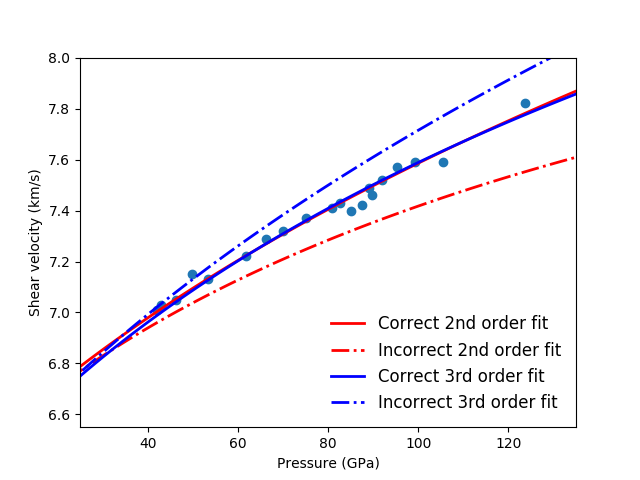

.. image:: figures/example_fit_data2.png

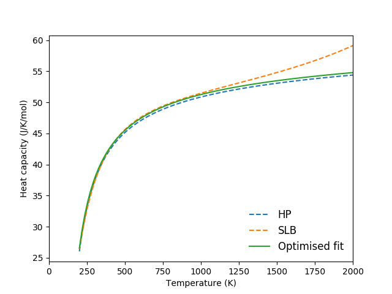

.. automodule:: examples.example_fit_eos

*Last seven resulting figures:*

.. image:: figures/example_fit_eos11.png

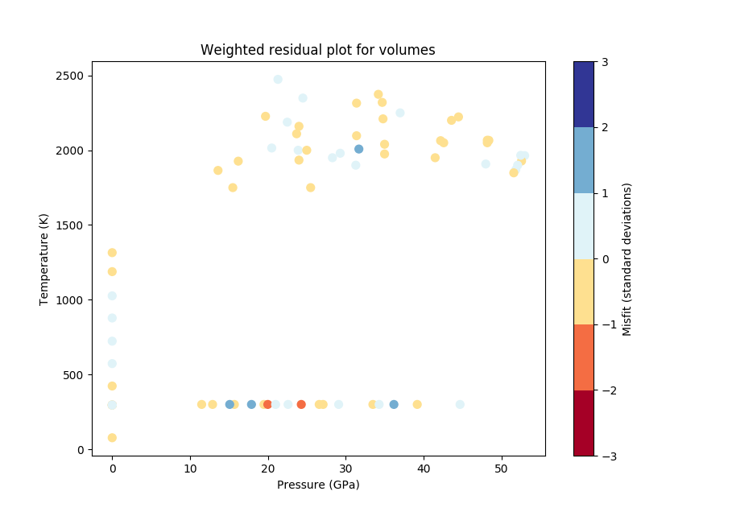

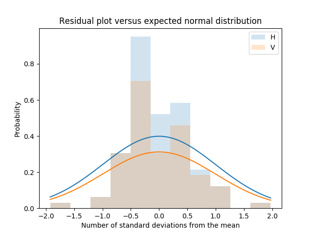

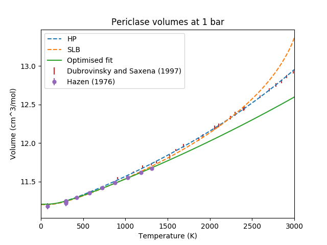

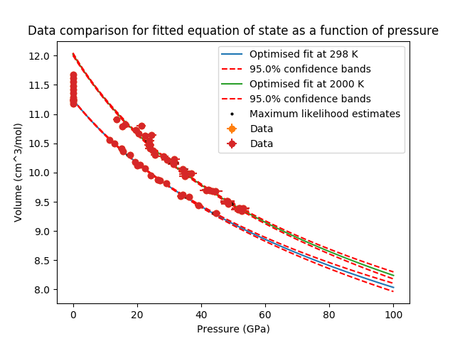

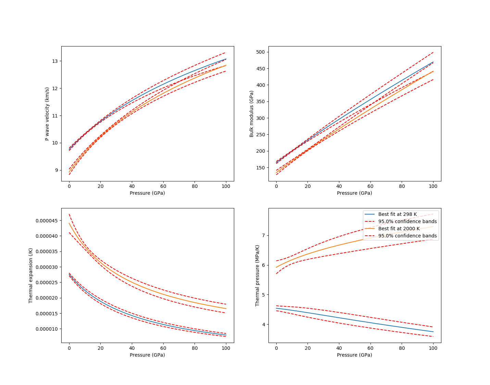

.. image:: figures/example_fit_eos17.png

.. automodule:: examples.example_equilibrate

*Resulting figures:*

.. figure:: figures/example_equilibrate_Figure_1_Al2SiO5.png

  The classic aluminosilicate diagram.

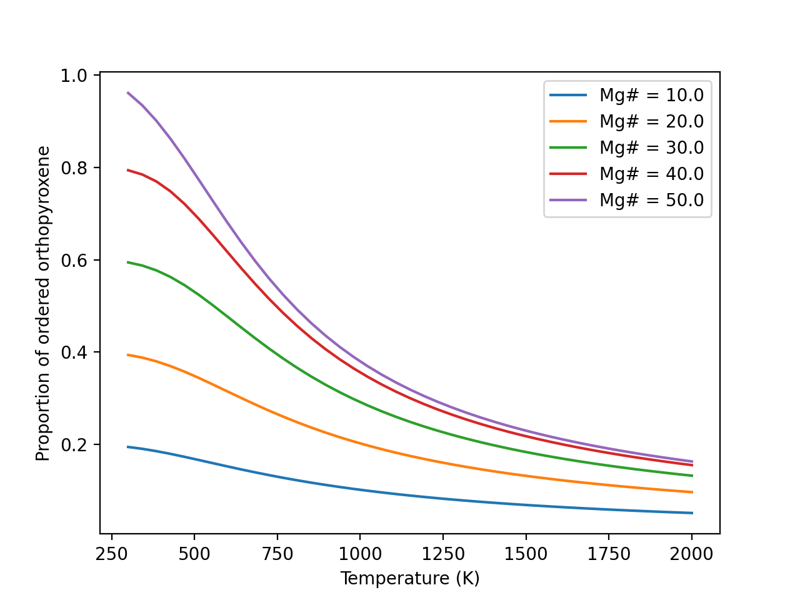

  Ordering in two site orthopyroxene.

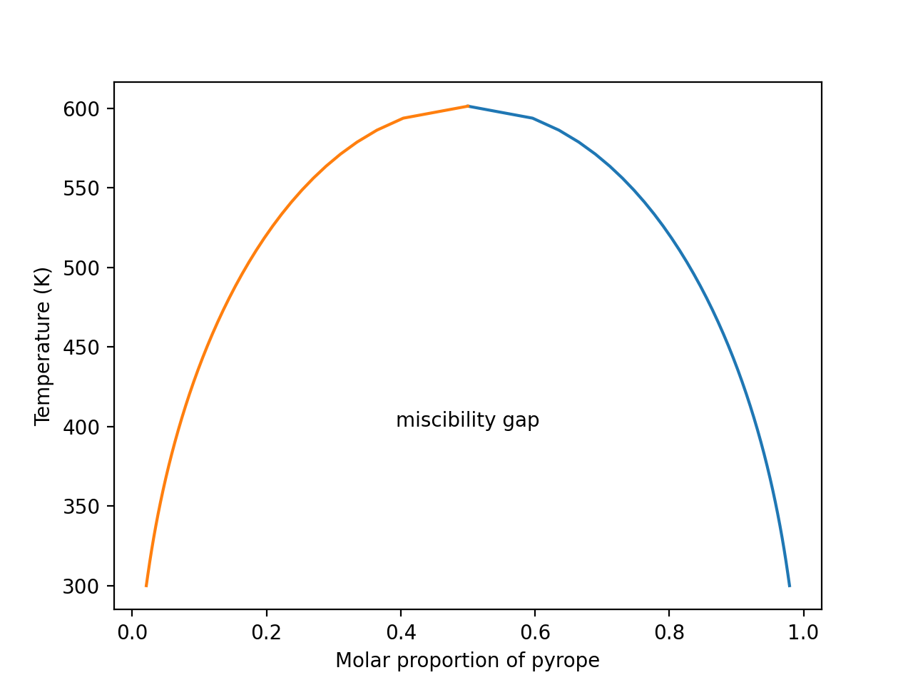

  Miscibility in the pyrope-grossular garnet system

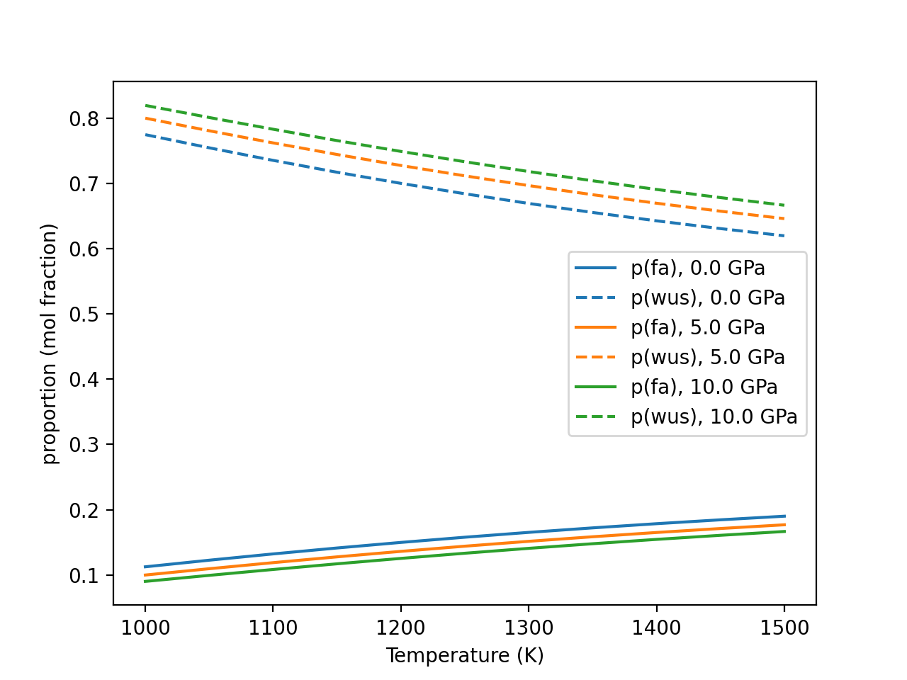

  Mg-Fe partitioning between olivine and ferropericlase.

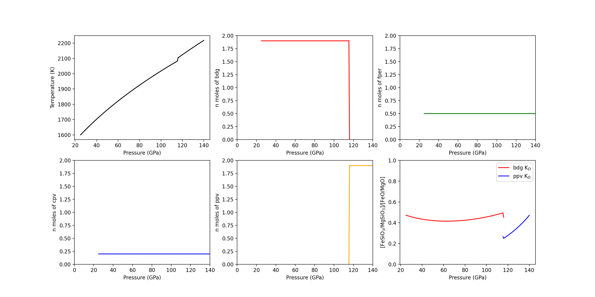

  Phase equilibria in the lower mantle.

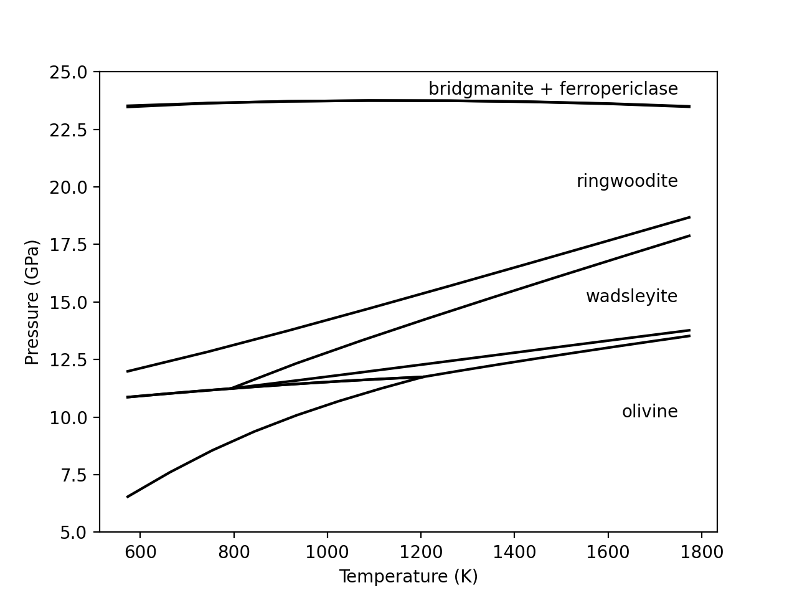

  A P-T pseudosection for a composition of Fe0.2Mg1.8SiO4 (fo90).

.. raw:: latex

    \clearpage

.. _ref-example-paper:

Reproducing Cottaar, Heister, Rose and Unterborn (2014)
=======================================================
In this section we include the scripts that were used for all computations and
figures in the 2014 BurnMan paper: Cottaar, Heister, Rose & Unterborn (2014) :cite:`Cottaar2014`

.. automodule:: contrib.CHRU2014.paper_averaging

.. automodule:: contrib.CHRU2014.paper_benchmark
   :exclude-members: check_slb_fig7_txt

.. automodule:: contrib.CHRU2014.paper_fit_data

.. automodule:: contrib.CHRU2014.paper_incorrect_averaging
   :exclude-members: ferropericlase,perovskite

.. automodule:: contrib.CHRU2014.paper_opt_pv
   :exclude-members: calc_shear_velocities,error

.. automodule:: contrib.CHRU2014.paper_onefit
   :exclude-members: array_to_rock, make_rock, output_rock, realization_to_array

.. automodule:: contrib.CHRU2014.paper_uncertain
   :exclude-members: my_perovskite

Misc or work in progress
========================

.. automodule:: examples.example_grid
.. automodule:: examples.example_woutput
