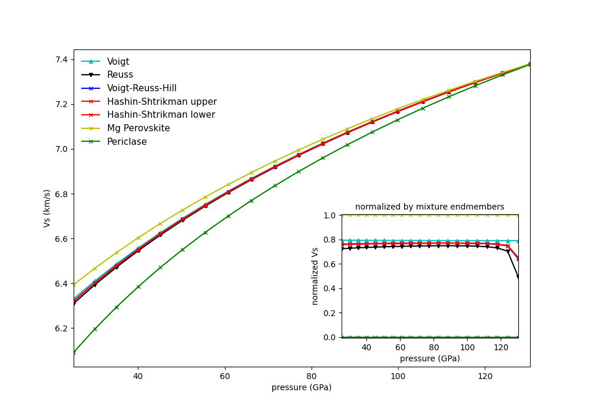

.. _ref-example-simple:

Simple Examples
===============

The following is a list of simple examples:
  - :mod:`~examples.example_beginner`,
  - :mod:`~examples.example_seismic`,
  - :mod:`~examples.example_composite_seismic_velocities`,
  - :mod:`~examples.example_averaging`, and
  - :mod:`~examples.example_chemical_potentials`.

.. automodule:: examples.example_beginner

*Resulting figure:*

.. image:: figures/example_beginner.png

.. automodule:: examples.example_seismic

*Resulting figures:*

.. image:: figures/example_seismic.png

.. image:: figures/example_seismic2.png

.. automodule:: examples.example_composite_seismic_velocities

*Resulting figure:*

.. image:: figures/example_composite_seismic_velocities.png

.. automodule:: examples.example_averaging

*Resulting figure:*

.. automodule:: examples.example_chemical_potentials

*Resulting figure:*

.. image:: figures/example_fO2.png