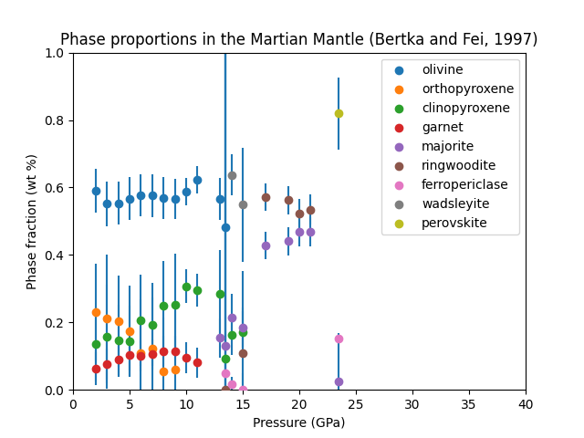
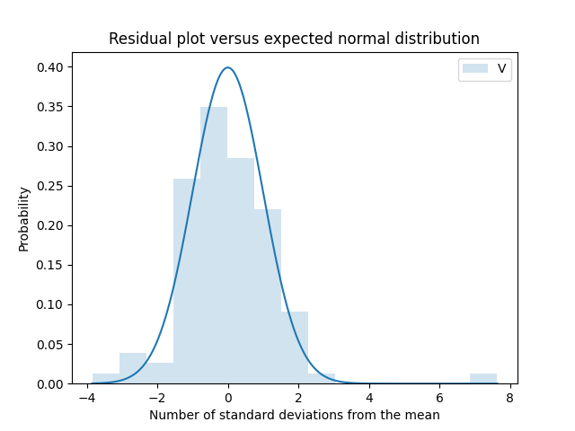
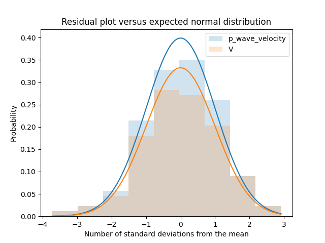
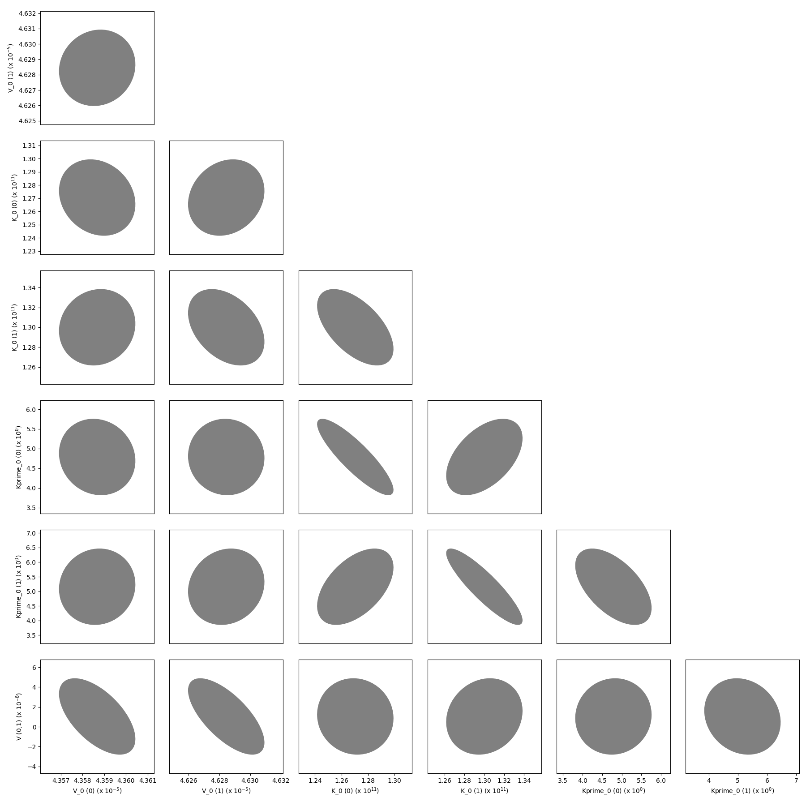
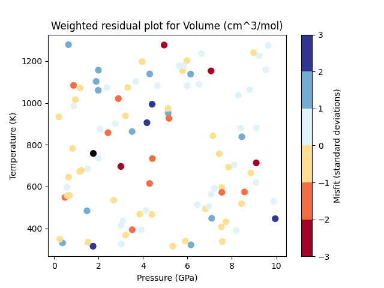
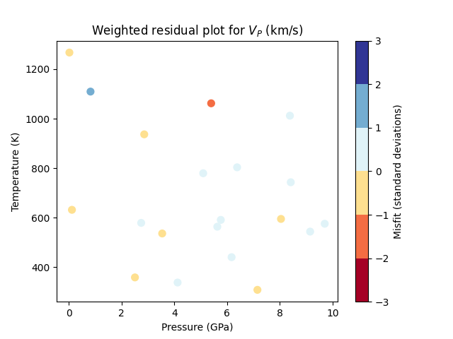

.. _ref-example-advanced:

More Advanced Examples
======================

Advanced examples:
  - :mod:`~examples.example_spintransition`,
  - :mod:`~examples.example_spintransition_thermal`,
  - :mod:`~examples.example_user_input_material`,
  - :mod:`~examples.example_optimize_pv`,
  - :mod:`~examples.example_compare_all_methods`,
  - :mod:`~examples.example_build_planet`,
  - :mod:`~examples.example_fit_composition`,
  - :mod:`~examples.example_fit_data`,
  - :mod:`~examples.example_fit_eos`,
  - :mod:`~examples.example_fit_solution`,
  - :mod:`~examples.example_optimal_thermobarometry`,
  - :mod:`~examples.example_equilibrate`, and
  - :mod:`~examples.example_olivine_binary`.

.. automodule:: examples.example_spintransition

*Resulting figure:*

.. image:: figures/example_spintransition.png

.. automodule:: examples.example_spintransition_thermal

*Resulting figure:*

.. image:: figures/example_spintransition_thermal.png

.. automodule:: examples.example_user_input_material

.. automodule:: examples.example_optimize_pv

*Resulting figure:*

.. image:: figures/example_opt_pv.png

.. automodule:: examples.example_compare_all_methods

*Resulting figure:*

.. image:: figures/example_compare_all_methods.png

.. automodule:: examples.example_build_planet

*Resulting figure:*

.. image:: figures/example_build_planet.png

.. automodule:: examples.example_fit_composition

*Resulting figure:*

.. automodule:: examples.example_fit_data

*Resulting figures:*

.. image:: figures/example_fit_data1.png

.. image:: figures/example_fit_data2.png

.. image:: figures/example_fit_data3.png

.. automodule:: examples.example_fit_eos

*Last seven resulting figures:*

.. image:: figures/example_fit_eos11.png

.. image:: figures/example_fit_eos12.png

.. image:: figures/example_fit_eos13.png

.. image:: figures/example_fit_eos14.png

.. image:: figures/example_fit_eos15.png

.. image:: figures/example_fit_eos16.png

.. image:: figures/example_fit_eos17.png

.. automodule:: examples.example_fit_solution

*Resulting figures:*

  Data residuals relative to the model fitted using all the provided data.

  Data residuals relative to the model fitted using the provided data after semi-automatic removal of spurious data.

  The variance-covariance matrix of the optimized parameters shown as a corner plot.

  A P-T plot showing the weighted residuals of each piece of volume data.

  A P-T plot showing the weighted residuals of each piece of P-wave velocity data.

.. automodule:: examples.example_equilibrate

*Resulting figures:*

.. figure:: figures/example_equilibrate_Figure_1_Al2SiO5.png

  The classic aluminosilicate diagram.

.. figure:: figures/example_equilibrate_Figure_2_opx_order.png

  Ordering in two site orthopyroxene.

.. figure:: figures/example_equilibrate_Figure_3_gt_miscibility.png

  Miscibility in the pyrope-grossular garnet system

.. figure:: figures/example_equilibrate_Figure_4_ol_fper.png

  Mg-Fe partitioning between olivine and ferropericlase.

.. figure:: figures/example_equilibrate_Figure_5_lower_mantle.png

  Phase equilibria in the lower mantle.

.. figure:: figures/example_equilibrate_Figure_6_ol_polymorphs.png

  A P-T pseudosection for a composition of Fe0.2Mg1.8SiO4 (fo90).

.. raw:: latex

    \clearpage

.. automodule:: examples.example_olivine_binary

*Resulting figures:*

.. figure:: figures/example_olivine_binary_Figure_1.png

  The olivine polymorph binary phase diagram using the thermodynamic models of Stixrude and Lithgow-Bertelloni (2011).
