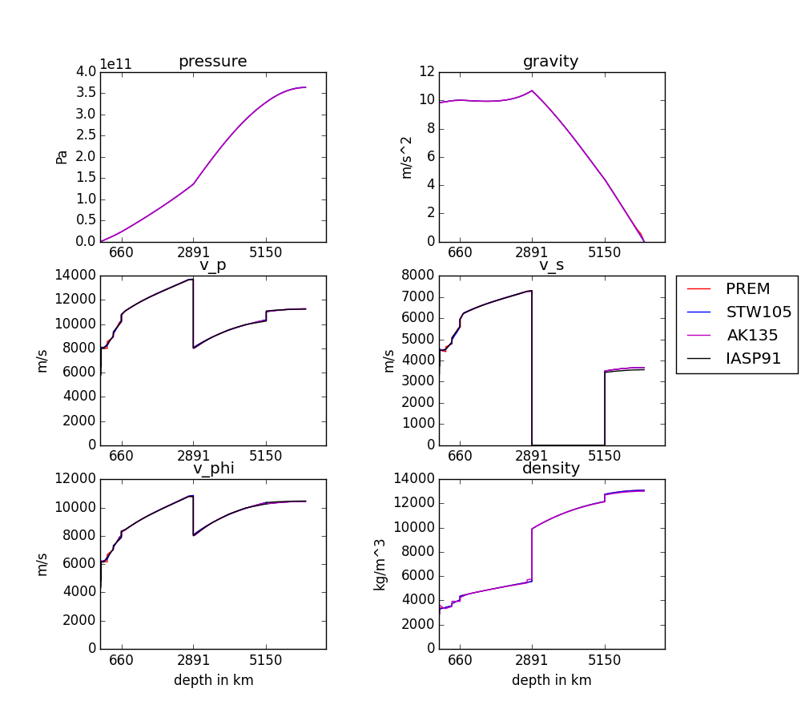
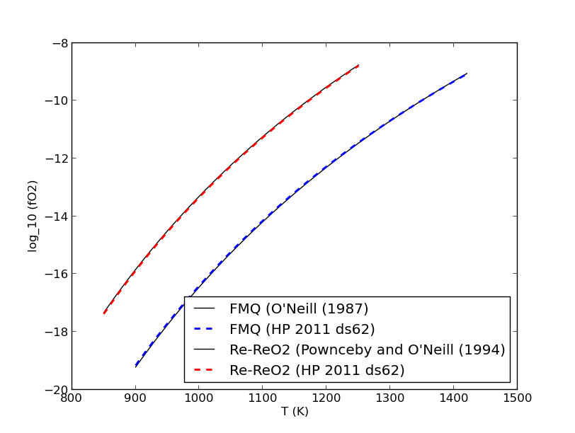
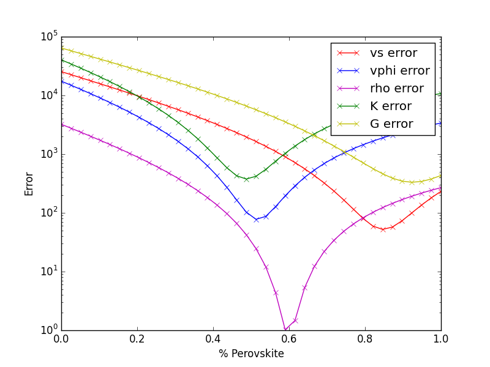
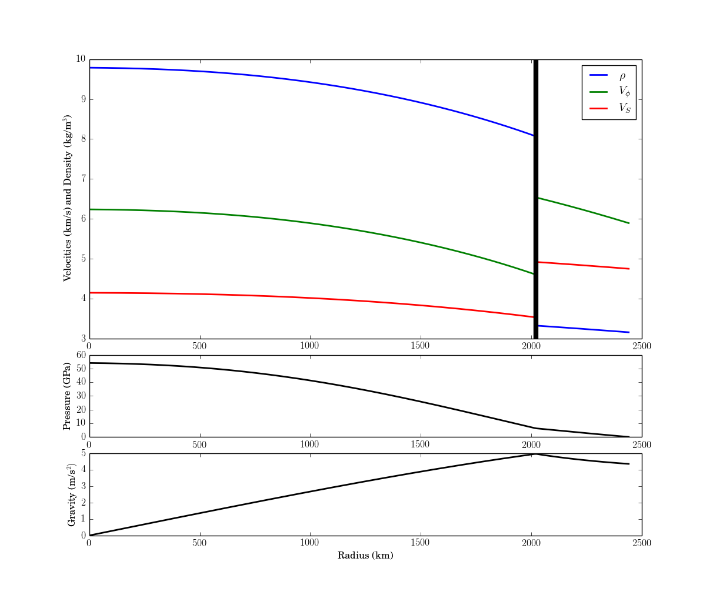

Examples
********

BurnMan comes with a small tutorial in the tutorial/ folder, and large
collection of example programs under examples/. Below you can find a summary
of the different examples. They are grouped into :ref:`ref-example-tutorial`,
:ref:`ref-example-simple`, and :ref:`ref-example-advanced`. We suggest
starting with the tutorial before moving on to the simpler examples,
especially if you are new to using BurnMan.

Finally, we also include the scripts that were used for all computations and
figures in the 2014 BurnMan paper in the misc/ folder, see
:ref:`ref-example-paper`.

.. _ref-example-tutorial:

Tutorial
========

The tutorial for BurnMan currently consists of three separate units:
  - :mod:`step 1 <contrib.tutorial.step_1>`,
  - :mod:`step 2 <contrib.tutorial.step_2>`, and
  - :mod:`step 3 <contrib.tutorial.step_3>`.

.. _ref-example-tut1:

.. automodule:: contrib.tutorial.step_1

When run (without putting in a more realistic composition), the program produces the following image:

.. image:: figures/tut-step1.png

Your goal in this tutorial is to improve this awful fit...

.. automodule:: contrib.tutorial.step_2

Whithout changing any input, the program should produce the following image showing the misfit as a function of perovskite content:

.. image:: figures/tut-step2.png

.. automodule:: contrib.tutorial.step_3

After changing the standard deviations for :math:`K_{0}^{'}` and :math:`G_{0}^{'}` to 0.2, the following figure of velocities for 1000 realizations is produced:

.. image:: figures/tut-step3.png

.. _ref-example-simple:

Simple Examples
===============

The following is a list of simple examples:
  - :mod:`~examples.example_beginner`,
  - :mod:`~examples.example_solid_solution`,
  - :mod:`~examples.example_geotherms`,
  - :mod:`~examples.example_seismic`,
  - :mod:`~examples.example_composition`,
  - :mod:`~examples.example_averaging`, and
  - :mod:`~examples.example_chemical_potentials`.

.. automodule:: examples.example_beginner

*Resulting figure:*

.. image:: figures/example_beginner.png

.. automodule:: examples.example_solid_solution

*Resulting figures:*

.. automodule:: examples.example_geotherms

*Resulting figure:*

.. image:: figures/example_geotherm.png

.. automodule:: examples.example_seismic

*Resulting figures:*

.. image:: figures/example_seismic2.png

.. automodule:: examples.example_composition  

*Resulting figure:*

.. image:: figures/example_composition.png

.. automodule:: examples.example_averaging

*Resulting figure:*

.. image:: figures/example_averaging.png

.. automodule:: examples.example_chemical_potentials

*Resulting figure:*

.. _ref-example-advanced:

More Advanced Examples
======================

Advanced examples:
  - :mod:`~examples.example_spintransition`,
  - :mod:`~examples.example_user_input_material`,
  - :mod:`~examples.example_optimize_pv`, and
  - :mod:`~examples.example_compare_all_methods`.

.. automodule:: examples.example_spintransition

*Resulting figure:*

.. image:: figures/example_spintransition.png

.. automodule:: examples.example_user_input_material

.. automodule:: examples.example_optimize_pv

*Resulting figure:*

.. automodule:: examples.example_build_planet

*Resulting figure:*

.. automodule:: examples.example_compare_all_methods  

*Resulting figure:*

.. image:: figures/example_compare_all_methods.png

.. _ref-example-paper:

Reproducing Cottaar, Heister, Rose and Unterborn (2014)
=======================================================
In this section we include the scripts that were used for all computations and
figures in the 2014 BurnMan paper: Cottaar, Heister, Rose & Unterborn (2014) :cite:`Cottaar2014`

.. automodule:: contrib.CHRU2014.paper_averaging

.. automodule:: contrib.CHRU2014.paper_benchmark
   :exclude-members: check_slb_fig7_txt

.. automodule:: contrib.CHRU2014.paper_fit_data

.. automodule:: contrib.CHRU2014.paper_incorrect_averaging
   :exclude-members: ferropericlase,perovskite

.. automodule:: contrib.CHRU2014.paper_opt_pv
   :exclude-members: calc_shear_velocities,error

.. automodule:: contrib.CHRU2014.paper_onefit
   :exclude-members: array_to_rock, make_rock, output_rock, realization_to_array

.. automodule:: contrib.CHRU2014.paper_uncertain
   :exclude-members: my_perovskite

Misc or work in progress
========================

.. broken: .. automodule:: example_optimize_slb2011
.. automodule:: examples.example_compare_enstpyro     
.. automodule:: examples.example_partition_coef

.. broken: .. automodule:: example_premite_isothermal

.. automodule:: examples.example_fit_data             
.. automodule:: examples.example_grid                 
.. automodule:: examples.example_woutput

