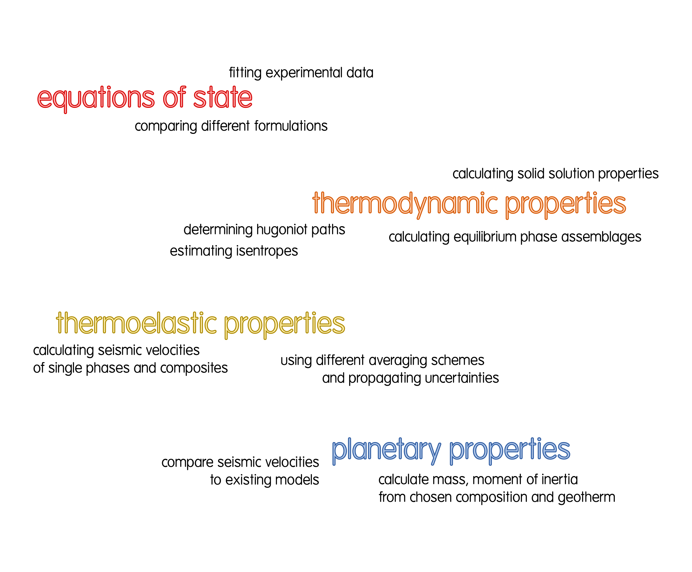

Overview
========

Overall Structure
-----------------

The goal of BurnMan is to calculate seismic velocity profiles for a given
mineral composition, geotherm, EoS, and averaging scheme.  These calculated
seismic velocity profiles can then be compared (either graphically or
quantitatively) to profiles computed for other compositions or constrained by
seismology.  It is written in the Python language and is run from the command
line.  This allows the library to be incorporated into other projects.
BurnMan makes extensive use of `SciPy <http://www.scipy.org/>`_ and `NumPy <http://www.numpy.org/>`_, which are widely used Python
libraries for scientific computation.  `Matplotlib <http://matplotlib.org/>`_ is used to display results
and produce publication quality figures.  The computations are consistently
done in SI units, although for this paper we convert units for plotting
purposes.  A large collection of annotated examples on the usage of BurnMan
are provided.  Scripts to reproduce the figures in this paper are included in
the toolbox.  We are happy to accept contributions in form of corrections,
examples, or new features.

The figure above shows each of the various steps in BurnMan and the input
required at each step.  The user sets the composition and temperature and
pressure profiles.  At later steps, the user can pick from several existing
methodologies or supply an alternative implementation.  This makes BurnMan
very extensible and allows for many combinations and configurations with which
to run calculations.  Eventually, one can choose or provide a seismic model
for comparison.

This flow setup can be used to evaluate the isotropic seismic velocities in a
geodynamic model or as the forward problem when inverting seismic profiles or
seismic velocity variations for mineralogical compositions and temperature.
The modular components of BurnMan can also be used separately or combined in
different ways than shown in the figure above. For example, one can input
experimental results at certain pressures and temperatures and fit reference
elastic moduli for a specific EoS.  Additionally, one can implement their own
alternatives for each of the existing modules.  BurnMan has the potential to
expand to other planetary applications.  While all the features are modular,
everything is available in a single library.

